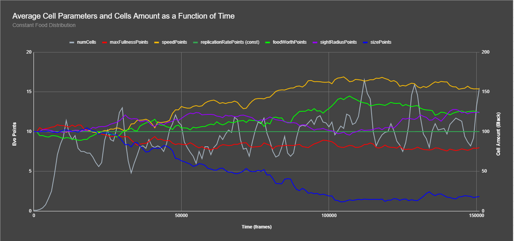

# Evo-V3-Unity

## A genetic algorithm built on the unity platform to allow simulating evolution of organisms

##### Made by: Shahar Yair

### To run the alorithm, clone the repository and run as a unity project.

#### Requirements:

- Unity version 2021.3.0f1
- 8 GB RAM

### While the simulation is running, you can travel and click on cells to get their current real-time data!

#### Travel using (Right-Click + WASD).

#### Speed-up by pressing (Shift).

#### Get data by clicking on the cells (Left-Click).

## Output:

#### You may stop the simulation at any time.

#### The simulation streams the data in real-time to a csv file in its folder with the starting timestamp.

#### Example output of the simulation data converted to graph:

